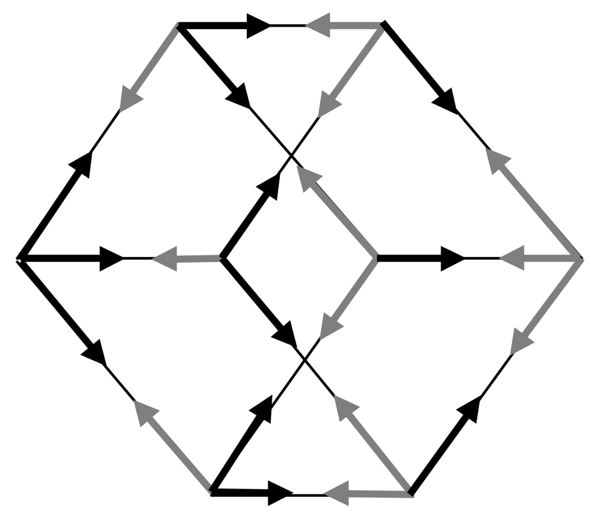

# Exploring the Quantum Random Walk Search Algorithm

## Qiskit Competion project: Explore the quantum random walk search algorithm

#### [Qiskit Community Summer Jam - North Carolina](https://www.hackerearth.com/challenges/hackathon/qiskit-community-summer-jam-north-carolina/)

### Project
We implement a Quantum Random Walk search algorithm on an n-dimensional hypercube, first described by [Shenvi et al](https://arxiv.org/abs/quant-ph/0210064). We give multiple implementations in Qiskit, first as a unitary operator and then decomposed into more compact gates two-level unitary gates. Finally, going beyond the search algorithm, we map the output of the Quantum Random Walk circuit to grid, taking inspiration from Cellular Automata. We plan to extend our quantum random walk algorithm code by implementing Google's PageRank in Qiskit (with an efficient Szegedy quantum walk). 

### Introduction (excerpt from final report notebook)
Random walks are one of the most powerful tools used in science and modeling-- they emerge in fields as wide ranging as psychology, physics, biology, and economics. The general case of random walks, Markov chains, are extensively used in machine learning and Bayesian statistics. In short, random walks are a powerful backbone for many further algorithms. Quantum random walks can offer a powerful algorithmic tool that outperform their classical analogues, one example being Google's well known PageRank algorithm.

## [Project Final Report Notebook](https://github.com/nickk124/quantumsearch/blob/master/random_walk_search.ipynb)
## [Project Presentation Slides](https://github.com/nickk124/quantumsearch/blob/master/quantum_search_presentation.pdf)

